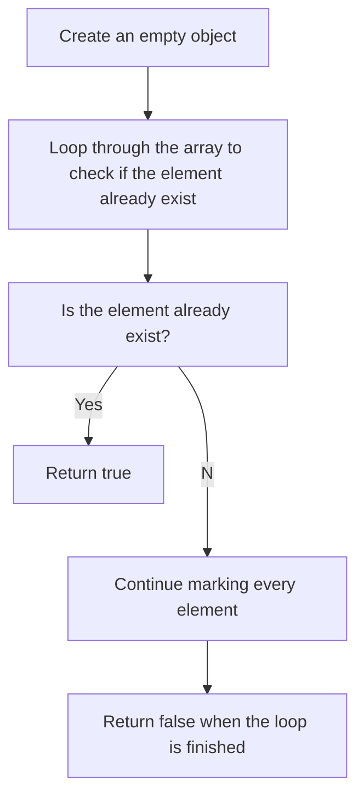

# Contains Duplicate

## 1st Solution

Comparing the length of a set with the original array. Same length means there is no duplicate.

## 2nd Solution

To check if an element already exists, use the iterated element as a key with a default value of true. When iterated, if a property with that key has a value of true, it means that the same number must have been visited in the earlier iteration.
