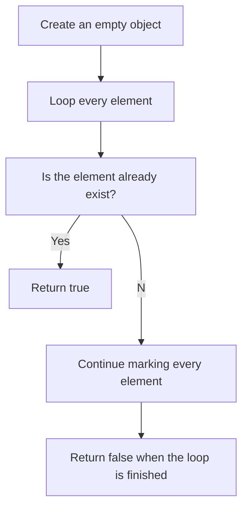

# Contains Duplicate

## 1st Solution

Comparing the length of a set with the original array. Same length means there is no duplicate.

## 2nd Solution

```mermaid
graph TD;
    A[Create an empty object]-->B[Loop every element];
    B[Loop every element]-->C[Is the element already exist?];
    C[Is the element already exist?]--Yes-->D[Return true];
    C[Is the element already exist?]--No-->E[Continue marking every element];
    E-->F[Return false when the loop is finished];
```
