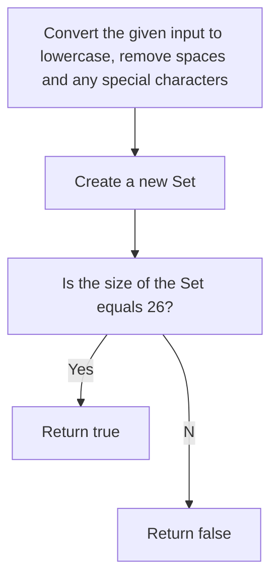

# Pangram

To check if all letters exist, use ES6 Set to automatically filter duplicate, then check the size of the Set if it equals 26 or not

```mermaid
graph TD;
    A[Convert the given input to lowercase, remove spaces and any special characters]-->B[Create a new Set];
    B-->C[Is the size of the Set equals 26?];
    C--Yes-->D[Return true];
    C--No-->E[Return false];
```
