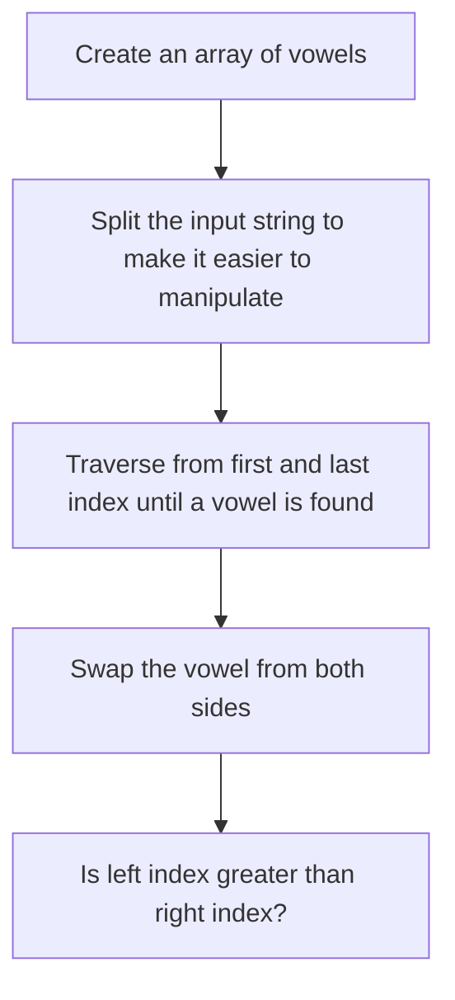

# Reverse Vowels

Use two pointers

```mermaid
graph TB;
    A[Create an array of vowels]-->B[Split the input string to make it easier to manipulate];
    B-->C[Traverse from first and last index until a vowel is found];
    C-->D[Swap the vowel from both sides];
    D-->E[Is left index greater than right index?];
   
```
