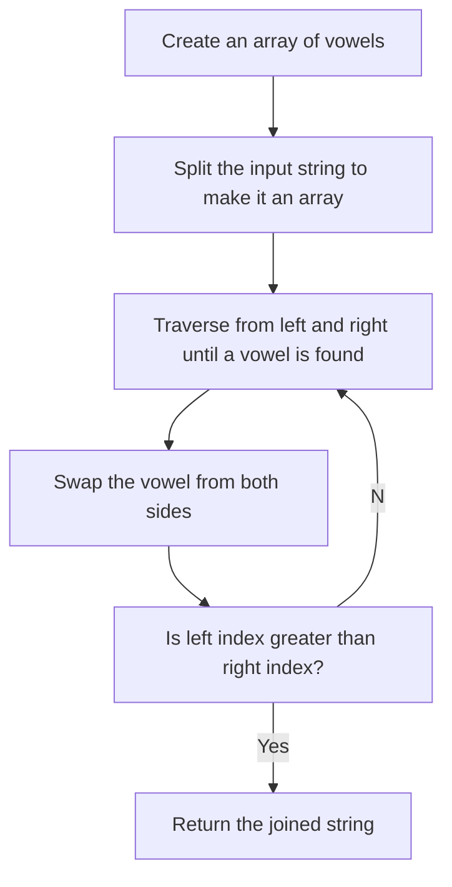

# Reverse Vowels

Use two pointers to get the index of two elements.
1. Convert the string into an array of characters
2. Declare a left variable which is from index 0 and right variable which is the last index of the input string
3. Increase the index if it founds a consonant
4. Swap if both vowels

